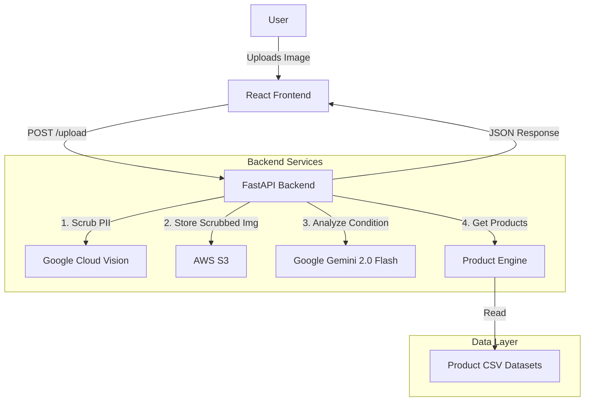

# Technical Overview: RadiantAI

**Architecture, AI Pipeline, and Recommendation Logic**

---

## 1. System Architecture

RadiantAI is built on a decoupled client-server architecture, designed for scalability and privacy.

### High-Level Diagram

---

## 2. AI Analysis Pipeline

The core of RadiantAI is its two-stage AI pipeline, designed to prioritize user privacy while delivering accurate dermatological insights.

### Stage 1: Privacy Scrubbing (Local Processing)
Before any analysis occurs, the image is processed to remove Personally Identifiable Information (PII).
- **Tool**: Python Pillow (PIL) Library.
- **Process**:
    1.  Removes EXIF metadata (GPS, camera details).
    2.  Converts image to a clean format (PNG) to strip hidden data.
    3.  The original image is discarded; only the scrubbed image is stored/analyzed.
- **Code**: `src/services/privacy.py`

### Stage 2: Dermatological Analysis (Ensemble AI)
The scrubbed image is sent to two AI models in parallel.

#### A. Qualitative Analysis (Google Gemini)
- **Tool**: Google Gemini 2.0 Flash.
- **Role**: The "Brain". Analyzes condition type, severity, and provides recommendations.
- **Output**: Structured JSON with condition details.

#### B. Object Localization (Google Cloud Vision)
- **Tool**: Google Cloud Vision API (`object_localization`).
- **Role**: The "Eyes". Detects specific objects and returns bounding boxes.
- **Output**: List of detected objects with coordinates.
- **Code**: `src/services/analysis.py`

---

## 3. Recommendation Engine

The recommendation engine maps the AI's findings to a curated database of skincare products.

### Data Source
- **Format**: CSV files located in `data/`.
- **Structure**: `Product_Name`, `Brand`, `Price`, `Ingredients`, `Rating`, `Skin_Type_Suitability`.

### The Algorithm (`src/services/product_recommender.py`)

1.  **Condition Extraction**: The engine parses the JSON response from Gemini to identify all detected conditions (e.g., Acne + Dry Skin).
2.  **Product Retrieval**:
    - It loads the specific CSVs for each detected condition.
    - It filters products based on the user's budget (if set).
3.  **Stratified Sampling (The "Freshness" Logic)**:
    - Instead of always returning the top 3 products, the engine selects the top 15 candidates (based on rating/price).
    - It randomly samples 3 products from this top tier.
    - This ensures users see different valid options on subsequent visits.
4.  **The "Bundle" Logic**:
    - The engine attempts to build a complete routine (Cleanser + Treatment + Moisturizer).
    - **Knapsack-style Optimization**: If a budget is set (e.g., ), it tries to find the best combination of 3 items where `Sum(Prices) <= Budget`.

---

## 4. Tech Stack Details

### Backend
- **Framework**: FastAPI (Python 3.12)
- **Performance**: Async/Await for non-blocking API calls.
- **Validation**: Pydantic models for request/response schemas.

### Frontend
- **Framework**: React 18 (Vite)
- **Language**: TypeScript
- **Styling**: Tailwind CSS
- **State**: LocalStorage for persisting analysis results across reloads.

### Infrastructure
- **Storage**: AWS S3 (Standard class) for storing anonymized user images.
- **Compute**: Runs on any containerized environment (Docker ready).

---

## 5. Future Roadmap

- **User Accounts**: Save history and track skin progress over time.
- **Feedback Loop**: Allow users to rate recommendations to fine-tune the engine.
- **Affiliate Integration**: Direct links to purchase products.
